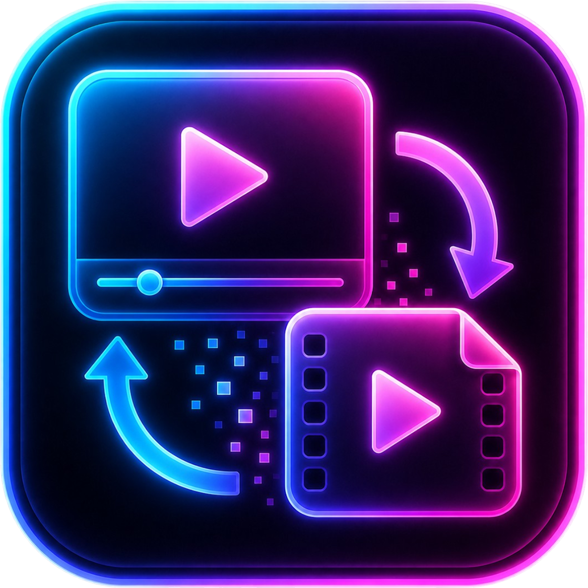

# Video Converter

Una solución de escritorio elegante y potente para la conversión, redimensionamiento y optimización masiva de videos e imágenes. Esta versión utiliza una interfaz web moderna (Vue 3) conectada a un backend local (FastAPI), utilizando **FFmpeg** como motor de procesamiento.


---

## 🎨 Icono del Proyecto

<p align="center">
  
</p>

---

## 📁 Estructura del Proyecto

```
video_converter/
├── 0-FFmpeg/            ← Coloca aquí los binarios de FFmpeg (opcional)
│   └── bin/
│       ├── ffmpeg.exe
│       └── ffprobe.exe
├── 1-input/             ← Carpeta por defecto para tus videos originales
├── 2-output/            ← Carpeta donde se guardarán los videos convertidos
├── backend/
│   ├── main.py          ← Servidor FastAPI (puerto 8002)
│   └── video_converter_config.json ← Configuración guardada
├── frontend/
│   └── index.html       ← Interfaz de usuario (Vue 3)
└── start.bat            ← Script de inicio rápido
```

---

## ✨ Características Principales

*   **🔄 Conversión Multi-formato**: Soporte para **MP4 (H.264), WEBM (VP9)** y **AV1 Video**.
*   **📊 Análisis en Tiempo Real**: Doble barra de progreso (lote completo + archivo actual) con datos en tiempo real via Server-Sent Events (SSE).
*   **📏 Redimensionamiento Adaptativo**: Opciones para sin resize, solo ancho (mantiene proporción) o tamaño W×H exacto.
*   **⚡ Control de Calidad**: Ajuste de CRF (Constant Rate Factor) y velocidad de CPU para AV1.
*   **🛠️ Control Total**: Opciones para eliminar audio, sobreescribir existentes y abrir carpeta al terminar.
*   **📝 Registro Detallado**: Log guardado automáticamente en la carpeta de salida (`conversion_log.txt`).
*   **📉 Métrica de Eficiencia**: Calcula y muestra el porcentaje de reducción de tamaño tras la conversión.

---

## 📋 Requisitos del Sistema

### 1. Python 3.8 o superior
Asegúrate de tener Python instalado. Durante la instalación en Windows, marca la casilla **"Add Python to PATH"**.

Instala las dependencias necesarias:
```bash
pip install fastapi uvicorn
```

### 2. FFmpeg (El Motor)
Esta aplicación utiliza FFmpeg para el procesamiento de video e imágenes.
1. El proyecto está configurado por defecto para buscar FFmpeg en la carpeta `0-FFmpeg/bin/` en la raíz del proyecto.
2. Si prefieres usar la versión del sistema, asegúrate de que `ffmpeg` y `ffprobe` estén en el PATH o actualiza la ruta en la interfaz web.
3. **Instalación local**: Descarga los binarios de FFmpeg y coloca los ejecutables (`ffmpeg.exe`, `ffprobe.exe`) dentro de la carpeta `0-FFmpeg/bin/`.

---

## 🎞️ Formatos Soportados

| Formato | Codec | Entrada | Notas |
|---------|-------|---------|-------|
| MP4 | H.264 (libx264) | .mov .mp4 .avi .mkv .webm | CRF 0-51, recomendado 18-28 |
| WEBM | VP9 (libvpx-vp9) | .mov .mp4 .avi .mkv .webm | CRF 0-63, recomendado 24-33 |
| AV1 | AV1 (libaom-av1) | .mov .mp4 .avi .mkv .webm | Video AV1 (WebM), CRF 0-63 |

---

## 🚀 Cómo Usar

1. **Coloca tus videos** en la carpeta `1-input/`.
2. Elige una de las siguientes opciones para iniciar la aplicación:

### Opción A: Inicio Rápido (Recomendado)
Simplemente haz doble clic en el archivo **`start.bat`**. Esto hará:
1. Abrirá la interfaz web (`frontend/index.html`) en tu navegador predeterminado.
2. Iniciará el servidor backend de Python.

*Nota: También puedes acceder a la aplicación escribiendo `http://localhost:8002` en tu navegador una vez que el servidor esté corriendo.*

### Opción B: Inicio Manual
Si prefieres iniciarlo manualmente:
1. Abre una terminal en la carpeta `backend` y ejecuta:
   ```bash
   python main.py
   ```
2. Abre el archivo `frontend/index.html` directamente en tu navegador o accede a `http://localhost:8002`.

3. **Configura** las opciones en la interfaz web y presiona **"Iniciar conversión"**. Los resultados se guardarán en `2-output/`.

---

## 🔌 API Endpoints

El backend expone una API en `http://localhost:8002`:

| Método | Ruta | Descripción |
|--------|------|-------------|
| GET | `/api/config` | Carga la configuración guardada |
| POST | `/api/config` | Guarda la configuración |
| GET | `/api/formats` | Obtiene los formatos soportados |
| POST | `/api/start` | Inicia la conversión |
| POST | `/api/stop` | Detiene la conversión |
| GET | `/api/events` | Stream SSE de progreso en tiempo real |
| GET | `/api/status` | Estado del worker |
| POST | `/api/shutdown` | Apaga el servidor backend |
| GET | `/api/select-folder` | Abre diálogo para seleccionar carpeta |

---

## 📝 Notas
- La configuración se guarda automáticamente en `backend/video_converter_config.json`.
- El diálogo de selección de carpetas utiliza una ventana nativa (Tkinter) que se abrirá sobre tu navegador cuando hagas clic en seleccionar carpeta.

---
*Desarrollado por **gwalls86***
